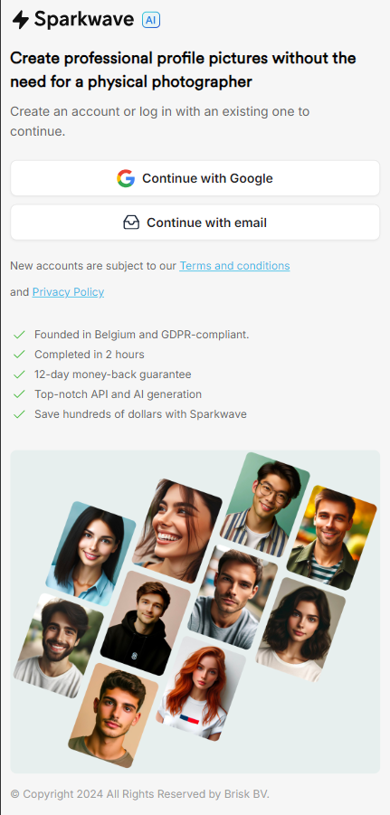

# SparkwaveAi
 
Dit project richt zich op de ontwikkeling van een authenticatiesysteem voor webapplicaties waarbij gebruikers de mogelijkheid hebben om in te loggen via hun Google-account of een persoonlijk e-mailadres. Ik heb zowel de front-end als de back-end zelfstandig ontwikkeld.

Zie backend: https://github.com/TalhaFerahPXL/Swym-Login-Frontend

## 🎨 Ontwerp
 De ontwerpen heb ik ontvangen van mijn werkplekcoach tijdens mijn stage en ik heb de applicatie gebouwd met speciale aandacht voor pixel-perfecte ontwikkeling

## 💻 Technologieën

- **Google OAuth 2.0**: Gebruikt voor veilige en eenvoudige inlogfunctionaliteit met Google-accounts waarbij tokens in plaats van wachtwoorden worden gebruikt voor extra beveiliging.
  
- **JWT (JSON Web Tokens)**: Ingezet voor sessiemanagement om gebruikersinformatie veilig over te dragen en de sessiestatus te behouden zonder voortdurende authenticatie.

- **Express (Node.js)**: Gebruikt voor het opzetten van de serveromgeving en het afhandelen van routes en inlogverzoeken inclusief middleware voor authenticatie.

- **SMTP-client (.NET)**: Voor het versturen van verificatie-e-mails naar nieuwe gebruikers bij aanmelding via een externe SMTP-server.

- **.NET Core Web API**: Gebruikt om RESTful API's te ontwikkelen voor gebruikersauthenticatie, veilige dataoverdracht, hashing van gegevens, en e-mailverificatie.

- **Bcrypt**: Voor het hashen van wachtwoorden om een extra beveiligingslaag te bieden tegen datalekken.

- **WebStorm**: Gebruikt voor de ontwikkeling van de frontend, met ondersteuning voor technologieën zoals HTML, CSS, JavaScript, Node.js, en Express.js.

- **SQL Server Management Studio (SSMS)**: Voor het beheren en beveiligen van gebruikersgegevens in de database.

- **Python**: Gebruikt om scripts te maken voor het testen van veelvoorkomende XSS-aanvallen op de website.

## 🔍 Onderzoek
Lees mijn proef over de inlogprocessen
* *https://github.com/TalhaFerahPXL/SparkwaveAi/blob/main/Graduaatsproef_Ferah_Talha.pdf*

# 📸 Screenshots

<h3>Dashboard Google Gebruiker</h3>

<h3>Dashboard Eigen Email Gebruiker</h3>

<h3>De Email Verificatie Email</h3>

<h3>De User Tabel in SQL Server Management Studio</h3>

